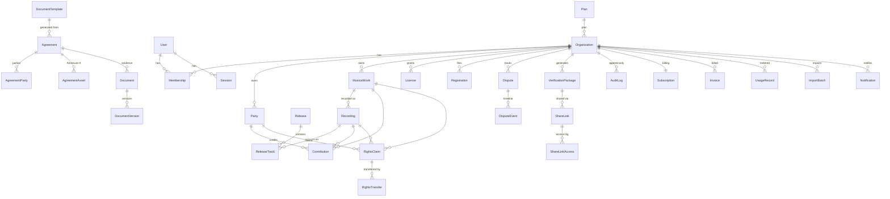

# Entity diagram (core)

```mermaid
erDiagram
  Plan ||--o{ Organization : "plan"
  Organization ||--o{ Membership : has
  User ||--o{ Membership : has
  User ||--o{ Session : has
  Organization ||--o{ Party : owns
  Organization ||--o{ MusicalWork : owns
  MusicalWork ||--o{ Recording : "recorded as"
  Release ||--o{ ReleaseTrack : contains
  Recording ||--o{ ReleaseTrack : "appears on"
  Party ||--o{ Contribution : credits
  MusicalWork ||--o{ Contribution : ""
  Recording ||--o{ Contribution : ""
  Party ||--o{ RightsClaim : claims
  MusicalWork ||--o{ RightsClaim : ""
  Recording ||--o{ RightsClaim : ""
  RightsClaim ||--o{ RightsTransfer : "transferred by"
  Organization ||--o{ License : grants
  Agreement ||--o{ AgreementParty : parties
  Agreement ||--o{ AgreementAsset : "Annexure-A"
  Agreement ||--o{ Document : evidence
  Document ||--o{ DocumentVersion : versions
  DocumentTemplate ||--o{ Agreement : "generated from"
  Organization ||--o{ Registration : files
  Organization ||--o{ Dispute : tracks
  Dispute ||--o{ DisputeEvent : timeline
  Organization ||--o{ VerificationPackage : generates
  VerificationPackage ||--o{ ShareLink : "shared via"
  ShareLink ||--o{ ShareLinkAccess : "access log"
  Organization ||--o{ AuditLog : "append-only"
  Organization ||--|| Subscription : billing
  Organization ||--o{ Invoice : billed
  Organization ||--o{ UsageRecord : metered
  Organization ||--o{ ImportBatch : imports
  Organization ||--o{ Notification : notifies
```

Full definitions: `apps/api/prisma/schema.prisma`. RLS policies: `apps/api/prisma/migrations/*_rls`.
